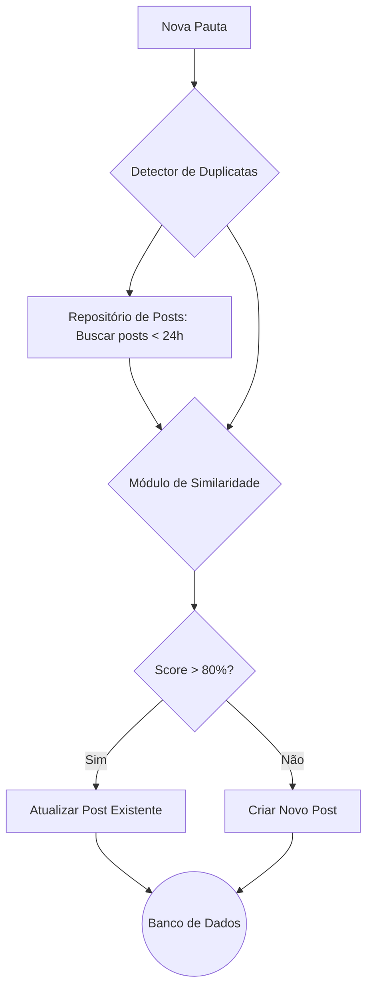

# Sistema de Detecção de Duplicatas para Pipeline de Notícias

**Autor**: Manus AI
**Data**: 09 de Janeiro de 2026
**Versão**: 1.0

## 1. Introdução

Este documento descreve a arquitetura e implementação de um sistema de detecção de duplicatas para o pipeline de geração de notícias do VivaCripto. O objetivo principal é evitar a publicação de conteúdo redundante sobre o mesmo evento, melhorando a qualidade do conteúdo e a otimização para motores de busca (SEO).

O sistema introduz uma etapa de verificação de **similaridade semântica** que analisa novas pautas de notícias contra posts publicados nas últimas 24 horas. Com base em um limiar de similaridade configurável, o sistema decide entre criar um novo post ou atualizar um existente com as novas informações.

## 2. Arquitetura da Solução

A solução é projetada de forma modular para garantir flexibilidade, escalabilidade e manutenibilidade. Os componentes principais são desacoplados e se comunicam através de interfaces bem definidas.

### 2.1. Componentes Principais

| Componente | Responsabilidade | Tecnologia Sugerida |
|---|---|---|
| **Módulo de Similaridade** | Calcula o score de similaridade entre dois textos (títulos e resumos). | Python, com estratégias de Levenshtein, TF-IDF e Embeddings. |
| **Repositório de Posts** | Abstrai o acesso aos dados de posts publicados, permitindo buscar posts recentes. | Interface agnóstica (pode ser implementada com SQL, NoSQL, ou em memória). |
| **Detector de Duplicatas** | Orquestra o processo: busca posts, calcula similaridade e aplica a lógica de decisão. | Python. |
| **Orquestrador de Pipeline** | Gerencia o fluxo de processamento de pautas em lote e executa as ações recomendadas. | Python. |

### 2.2. Fluxo de Processamento

O fluxo de dados foi desenhado para ser simples e eficiente. Ao receber uma nova pauta, o sistema executa os seguintes passos:

1.  **Recebimento da Pauta**: O Orquestrador de Pipeline recebe uma nova pauta de notícia, contendo título, resumo, e conteúdo.
2.  **Busca de Candidatos**: O Detector de Duplicatas consulta o Repositório de Posts para obter todos os artigos publicados nas últimas 24 horas.
3.  **Cálculo de Similaridade**: Para cada post recente, o Módulo de Similaridade calcula um score de similaridade entre o texto da nova pauta e o do post existente.
4.  **Tomada de Decisão**: Com base no score máximo de similaridade encontrado, o sistema aplica a seguinte lógica:
    *   **Similaridade > Threshold (padrão: 80%)**: A pauta é considerada uma duplicata. A ação recomendada é **ATUALIZAR** o post existente.
    *   **Similaridade < Threshold**: A pauta é considerada conteúdo novo. A ação recomendada é **CRIAR** um novo post.
5.  **Execução da Ação**: O Orquestrador executa a ação, seja criando um novo registro no banco de dados ou atualizando um post existente com um novo timestamp e um registro da atualização.



## 3. Guia de Implementação

A solução é composta por três arquivos Python principais e um arquivo de testes.

### 3.1. Estrutura de Arquivos

```
/home/ubuntu/
├── similarity_engine.py       # Contém as lógicas de cálculo de similaridade
├── duplicate_detector.py      # Contém a orquestração e a lógica de decisão
├── test_duplicate_detector.py # Testes unitários e de integração
└── vivacripto_documentacao_tecnica.md # Este documento
```

### 3.2. `similarity_engine.py`

Este módulo oferece uma `SimilarityFactory` para criar diferentes motores de cálculo de similaridade. A implementação atual inclui:

*   `LevenshteinSimilarity`: Baseado na distância de edição. Rápido, mas superficial.
*   `TFIDFSimilarity`: Baseado na frequência de termos. Melhor para similaridade de tópicos.
*   `EmbeddingSimilarity`: **(Recomendado para Produção)** A mais robusta, baseada em embeddings de sentenças. Requer a instalação da biblioteca `sentence-transformers`.
*   `HybridSimilarity`: Combina os scores dos outros métodos com pesos configuráveis.

Para um ambiente de produção, é fortemente recomendado habilitar o `EmbeddingSimilarity` para obter a melhor precisão semântica. Para isso, instale a dependência:

```bash
sudo pip3 install sentence-transformers
```

### 3.3. `duplicate_detector.py`

Este é o coração do sistema. As classes principais são:

*   `PublishedPost` e `NewsAssignment`: Estruturas de dados que representam os posts e as pautas.
*   `PostRepository`: Uma interface para o banco de dados. A implementação `InMemoryPostRepository` é fornecida para testes, mas deve ser substituída por uma implementação conectada ao banco de dados de produção (ex: PostgreSQL, MySQL, MongoDB).
*   `DuplicateDetector`: Classe principal que implementa a lógica de verificação.
*   `PipelineOrchestrator`: Gerencia o processamento de múltiplas pautas.

**Para integrar ao pipeline do VivaCripto:**

1.  **Implemente `PostRepository`**: Crie uma classe que herde de `PostRepository` e implemente os métodos `get_posts_last_24h`, `save_post`, e `update_post` para interagir com o banco de dados real do VivaCripto.
2.  **Instancie o Orquestrador**: No seu pipeline de ingestão de notícias, antes de criar um novo post, instancie e utilize o `PipelineOrchestrator`.

**Exemplo de uso:**

```python
from duplicate_detector import PipelineOrchestrator, DuplicateDetector, NewsAssignment
# Importe sua implementação customizada do repositório
from my_database_connector import ProductionPostRepository

# 1. Crie uma instância do seu repositório
repo = ProductionPostRepository()

# 2. Crie o detector, ajustando o threshold se necessário
#    Para produção com embeddings, 0.80 é um bom ponto de partida.
#    Sem embeddings, um valor entre 0.40 e 0.50 pode ser mais realista.
detector = DuplicateDetector(
    repository=repo,
    similarity_threshold=0.80, # Ajuste conforme os testes
    engine_type="embedding" # Use 'embedding' ou 'hybrid' em produção
)

# 3. Crie o orquestrador
orchestrator = PipelineOrchestrator(detector)

# 4. Crie uma lista de pautas para processar
assignments = [
    NewsAssignment(
        titulo="Bank of America e Coinbase anunciam parceria",
        resumo="...",
        conteudo="...",
        fonte="CoinDesk",
        timestamp=datetime.now().isoformat()
    )
]

# 5. Processe o lote
results = orchestrator.process_batch(assignments)

print(results)
```

### 3.4. `test_duplicate_detector.py`

Um conjunto completo de testes unitários e de integração é fornecido para garantir a qualidade e o correto funcionamento do código. Os testes cobrem os motores de similaridade, a lógica do detector e cenários de integração realistas. Para executar os testes, utilize o comando:

```bash
python3.11 test_duplicate_detector.py
```

## 4. Conclusão

Esta solução fornece uma base robusta e extensível para resolver o problema de conteúdo duplicado no VivaCripto. A arquitetura modular permite futuras melhorias, como a integração de modelos de Machine Learning para ajuste dinâmico do threshold de similaridade ou a expansão para outros tipos de conteúdo. A implementação do motor de similaridade com embeddings é crucial para alcançar a precisão desejada em um ambiente de produção.
